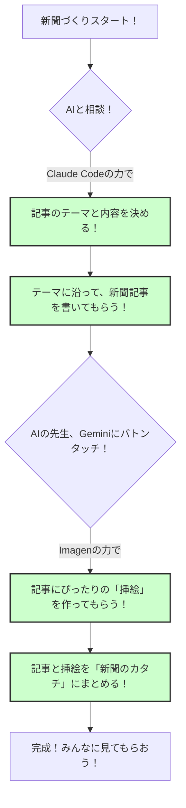

```mermaid
graph TD
    A[新聞づくりスタート！] --> B{AIと相談！};
    B -- Claude Codeの力で --> C["記事のテーマと内容を決める！"];
    C --> D["テーマに沿って、新聞記事を書いてもらう！"];
    D --> E{AIの先生、Geminiにバトンタッチ！};
    E -- Imagenの力で --> F["記事にぴったりの「挿絵」を作ってもらう！"];
    F --> G["記事と挿絵を「新聞のカタチ」にまとめる！"];
    G --> H[完成！みんなに見てもらおう！];


style C fill:#ccffcc,stroke:#333,stroke-width:2px
style D fill:#ccffcc,stroke:#333,stroke-width:2px
style F fill:#ccffcc,stroke:#333,stroke-width:2px
style G fill:#ccffcc,stroke:#333,stroke-width:2px
```
