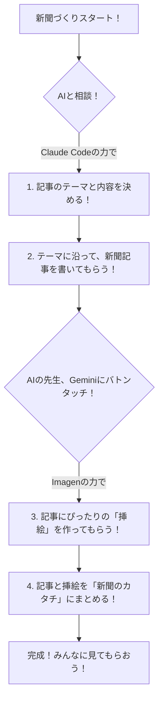

```mermaid
graph TD
    A[新聞づくりスタート！] --> B{AIと相談！};
    B -- Claude Codeの力で --> C[1. 記事のテーマと内容を決める！];
    C --> D[2. テーマに沿って、新聞記事を書いてもらう！];
    D --> E{AIの先生、Geminiにバトンタッチ！};
    E -- Imagenの力で --> F[3. 記事にぴったりの「挿絵」を作ってもらう！];
    F --> G[4. 記事と挿絵を「新聞のカタチ」にまとめる！];
    G --> H[完成！みんなに見てもらおう！];
```
